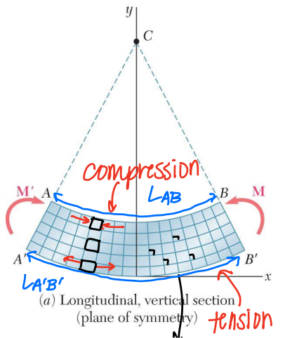
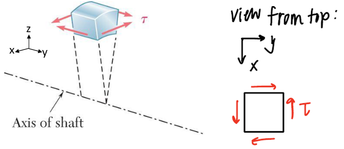

<style>
    red-text{
        background-color: red;
        color: black;
    }

    .background-yellow{
        background-color: #f0f0d0;
        border: 1px solid #444;
        border-radius: 5px;
    }

    display-equation{
        width: 100%;
        margin-bottom: 0.5rem;
        overflow: hidden;
    }
</style>

# Mechref Component Docs

The aim of using components is to maintain a consistant look and feel throughout the website, as well as being able to make changes without having to go through every page.

When relevant, I've tried to maintain the LateX naming scheme for ease of use by those coming directly from it with little coding experience. For example:
<ul>
<li> \item => `Item`</li>
<li> \itemize => `Itemize`</li>
<li> \enumerate => `Enumerate`</li>
</ul>
"Components" and "elements" will be used interchangeably throughout this document.

I want to:
<ul>
<li><a href="#basics">Learn how to add elements to my page, and the nuances when using HTML components</a></li>
<li><a href="#sections">Create a new section inside my page</a></li>
<li><a href="#latex">Add an equation</a></li>
<li><a href="#callout">Add a callout card</a></li>
<li><a href="#image">Add a image</a></li>
<li><a href="#utilities">Find elements that simplify my coding</a></li>
</ul>

<h2><a id="basics"> How to import components</a></h2>

Make sure to import the element at the top of the page before using it. If you get an error like `XXX is not defined`, this is typically what it's refering to. To import an element, use the following syntax:
```javascript
import Component from '../../components/Component.astro'
```
, where `Component` refers to the name of the component you want to import.

## Inserting components into HTML page

All HTML tags must be closed, which means when you add an element to the page, you must close it to indicate the beginning and the end of that element. Elements can be in two states: regular or self-closed. Regular means it follows the following convention:
```html
<Component> Content goes here... </Component>
```
Notice how the component has two tags, one start tag and one end tag with a forward-slash. This allows us to insert content inside the element when supported.

Self-closing tags follow another convention:
```html
<Component />
```

Now, the component only has one tag, essentially combining both the start and end tag. The component will still load, but we cannot insert any content inside it.

Depending on that state, the behavior of the component might be different. For example, let's take the `<DisplayEquation>` component. When declared with self closing tags, it will simply be displaying an equation that take up the entire width of the screen (or whichever element it's inside of):

```html
<DisplayEquation title="Normalization to unit vector." id="rvv-eu" background="True" equation="\\begin{aligned} \\hat{a} =\\frac{\\vec{a}}{a}\\end{aligned}"/>
```


But when in regular mode, whatever content we add inside of it will now be displayed inside the derivation menu:

```html
<DisplayEquation title="Normalization to unit vector." id="rvv-eu" background="True" equation="\\begin{aligned} \\hat{a} =\\frac{\\vec{a}}{a}\\end{aligned}" derivation="True">
    <p>Content goes here:</p>
    <DisplayEquation equation="\\vec{v} = \\vec{\\omega} \\times \\vec{r}"/>
</DisplayEquation>
```


This concept is very important, and applies to almost every component. The different behaviors will be discussed when explaining the different uses of each component.

## Elements currently added:

<h3><a id="sections" class="title">Section elements:</a></h3>

### Section

Type: Regular only

Options:
<ul>
<li>title: Displays title of the section.</li>
<li>id: Gives an id to the section so it can be linked to in the navigation tree or other pages.</li>
</ul>

Example:
```html
<Section title="Example Page" id="example_page">
    <p>Lorem ipsum dolor sit amet, consectetur adipiscing elit. Fusce nulla augue, interdum sed sapien non, dictum luctus risus. Maecenas pretium leo orci, condimentum vehicula libero scelerisque vel. Nulla hendrerit nunc a mauris elementum, id molestie augue dictum. Etiam convallis justo eu sem ultricies, sed ultricies tellus commodo. Nunc ac bibendum odio. Etiam non tincidunt mauris, vitae condimentum eros. Fusce id semper arcu, id dictum neque.</p>
</Section>
```

Result:

<h1 style="text-align: center;">Example page</h1>
<p>Lorem ipsum dolor sit amet, consectetur adipiscing elit. Fusce nulla augue, interdum sed sapien non, dictum luctus risus. Maecenas pretium leo orci, condimentum vehicula libero scelerisque vel. Nulla hendrerit nunc a mauris elementum, id molestie augue dictum. Etiam convallis justo eu sem ultricies, sed ultricies tellus commodo. Nunc ac bibendum odio. Etiam non tincidunt mauris, vitae condimentum eros. Fusce id semper arcu, id dictum neque.</p>

### SubSection

Same as Section, but with smaller title.

Type: Regular only

Options:
<ul>
<li>title: Displays title of the section.</li>
<li>id: Gives an id to the section so it can be linked to in the navigation tree or other pages.</li>
</ul>

Example:
```html
<SubSection title="Example Subsection" id="example_subsection">
    <p>Lorem ipsum dolor sit amet, consectetur adipiscing elit. Fusce nulla augue, interdum sed sapien non, dictum luctus risus. Maecenas pretium leo orci, condimentum vehicula libero scelerisque vel. Nulla hendrerit nunc a mauris elementum, id molestie augue dictum. Etiam convallis justo eu sem ultricies, sed ultricies tellus commodo. Nunc ac bibendum odio. Etiam non tincidunt mauris, vitae condimentum eros. Fusce id semper arcu, id dictum neque.</p>
</SubSection>
```
Result:
<h2 style="text-align: center;">Example Subsection</h2>
<p>Lorem ipsum dolor sit amet, consectetur adipiscing elit. Fusce nulla augue, interdum sed sapien non, dictum luctus risus. Maecenas pretium leo orci, condimentum vehicula libero scelerisque vel. Nulla hendrerit nunc a mauris elementum, id molestie augue dictum. Etiam convallis justo eu sem ultricies, sed ultricies tellus commodo. Nunc ac bibendum odio. Etiam non tincidunt mauris, vitae condimentum eros. Fusce id semper arcu, id dictum neque.</p>

### SubSubSection

Same as SubSection, but with smaller title.

Type: Regular only

Options:
<ul>
<li>title: Displays title of the section.</li>
<li>id: Gives an id to the section so it can be linked to in the navigation tree or other pages.</li>
</ul>

Example:
```html
<SubSubSection title="Example SubSubsection" id="example_subsubsection">
    <p>Lorem ipsum dolor sit amet, consectetur adipiscing elit. Fusce nulla augue, interdum sed sapien non, dictum luctus risus. Maecenas pretium leo orci, condimentum vehicula libero scelerisque vel. Nulla hendrerit nunc a mauris elementum, id molestie augue dictum. Etiam convallis justo eu sem ultricies, sed ultricies tellus commodo. Nunc ac bibendum odio. Etiam non tincidunt mauris, vitae condimentum eros. Fusce id semper arcu, id dictum neque.</p>
</SubSubSection>
```
Result:
<h3 style="text-align: center;">Example SubSubsection</h3>
<p>Lorem ipsum dolor sit amet, consectetur adipiscing elit. Fusce nulla augue, interdum sed sapien non, dictum luctus risus. Maecenas pretium leo orci, condimentum vehicula libero scelerisque vel. Nulla hendrerit nunc a mauris elementum, id molestie augue dictum. Etiam convallis justo eu sem ultricies, sed ultricies tellus commodo. Nunc ac bibendum odio. Etiam non tincidunt mauris, vitae condimentum eros. Fusce id semper arcu, id dictum neque.</p>

### SubSubSection

Same as SubSection, but with smaller title.

Type: Regular only

Options:
<ul>
<li>title: Displays title of the section.</li>
<li>id: Gives an id to the section so it can be linked to in the navigation tree or other pages.</li>
</ul>

Example:
```html
<SubSubSubSection title="Example SubSubsection" id="example_subsubsubsection">
    <p>Lorem ipsum dolor sit amet, consectetur adipiscing elit. Fusce nulla augue, interdum sed sapien non, dictum luctus risus. Maecenas pretium leo orci, condimentum vehicula libero scelerisque vel. Nulla hendrerit nunc a mauris elementum, id molestie augue dictum. Etiam convallis justo eu sem ultricies, sed ultricies tellus commodo. Nunc ac bibendum odio. Etiam non tincidunt mauris, vitae condimentum eros. Fusce id semper arcu, id dictum neque.</p>
</SubSubSubSection>
```
Result:
<h4 style="text-align: center;">Example SubSubSubsection</h4>
<p>Lorem ipsum dolor sit amet, consectetur adipiscing elit. Fusce nulla augue, interdum sed sapien non, dictum luctus risus. Maecenas pretium leo orci, condimentum vehicula libero scelerisque vel. Nulla hendrerit nunc a mauris elementum, id molestie augue dictum. Etiam convallis justo eu sem ultricies, sed ultricies tellus commodo. Nunc ac bibendum odio. Etiam non tincidunt mauris, vitae condimentum eros. Fusce id semper arcu, id dictum neque.</p>

<h3><a id="latex" class="title">Latex displaying elements:</a></h3>

These elements provide a wrapper for LateX equation, since we cannot use `{}` directly in the HTML, preventing us from writing complex equations. <red-text>Make sure to double every backslash</red-text>, e.g. \\vec => \\\\vec.

### DisplayEquation

This will create an element that takes the entire width of the element it's inside of, and is useful for important equations that deserve to be highlighted.

Type: Self-closing & Regular

Options:
<ul>
<li>equation: Insert your LateX equation here.</li>
<li>title: Displays a title above the equation.</li>
<li>id: Gives an id to the equation so it can be linked to in within the current page or from other pages. <red-text>Required when derivation is set to "True"</red-text>. Also allows the proper function of the derivation menu.</li>
<li>background: Adds the characteristic yellow background and black border around the equation when set to "True".</li>
<li>derivation: Adds a "Derivation +" button to expand the derivation menu when set to "True".</li>
</ul>

<u>Self-Closing:</u>

Will simply display equation. 

Example:

```html
<DisplayEquation title="Normalization to unit vector." id="rvv-eu" background="True" equation="Equation here"/>
```
Result:
<display-equation>
<div style="background-color: #f0f0d0; border: 1px solid #444; border-radius: 5px; color: black;">
<div style="margin-left: 1rem;">Normalization to unit vector. <small>rvv-eu</small></div>
<div style="width: 100%; display: flex; justify-content: center">
    <div style="margin-bottom: 1rem; margin-top: 1rem;">
        Equation here
    </div>
</div>
</div>
</display-equation>

<u>Regular mode:</u>

But when in regular mode, whatever content we add inside of it will now be displayed inside the derivation menu:

```html
<DisplayEquation title="Normalization to unit vector." id="rvv-eu" background="True" equation="Equation here" derivation="True">
    <p>Derivation goes here:</p>
</DisplayEquation>
```
Result:
<display-equation>
<div style="background-color: #f0f0d0; border: 1px solid #444; border-radius: 5px; color: black;">
<div style="margin-left: 1rem;">Normalization to unit vector. <small>rvv-eu</small></div>
<div style="width: 100%; display: flex; justify-content: center">
    <div style="margin-bottom: 1rem; margin-top: 1rem;">
        Equation here
    </div>
</div>
<button style="background-color: #6c757d; color: white;">Derivation -</button>
</div>
<div style="background-color: #f8f8f8; border: 1px solid #444; border-radius: 5px; width: 100%; display: flex; justify-content: center; color: black;">
    <div style="margin-bottom: 1rem; margin-top: 1rem;">
        Derivation goes here
    </div>
</div>
</display-equation>

### DisplayEquationCustom

Same as DisplayEquation, but provides a lot more freedom with how everything looks. Made for when equation boxes don't follow the format above.

Type: Regular only

Options:
<ul>
<li>title: Displays a title above the equation.</li>
<li>id: Gives an id to the equation so it can be linked to in within the current page or from other pages. <red-text>Required</red-text>. Also allows the proper function of the derivation menu.</li>
<li>background: Adds the characteristic yellow background and black border around the equation when set to "True".</li>
</ul>

```html
<DisplayEquationCustom title="Moment of inertia of prism." id="rvv-eu" background="True" equation="Equation here" derivation="True">
    <div class="w-100">
        <div class="w-50">
            <DisplayEquation equation="Random Equation here" />
        </div>
        <div class="w-50">
            <PrairieDrawCanvas id="rcm-cm-c" width="300" height="300" show_border="False">
        </div>
    </div>
    <div slot="derivation">
        <p>Derivation goes here:</p>
    </div>
</DisplayEquation>
```
<red-text>Important:</red-text> Note the use of the `<div slot="derivation"></div>`. This is required when adding a derivation inside a `DisplayEquationCustom` element.

Result:

<display-equation>
<div style="background-color: #f0f0d0; border: 1px solid #444; border-radius: 5px; color: black;">
<div style="margin-left: 1rem;">Moment of inertia of prism. <small>rvv-eu</small></div>
<div style="width: 100%; display: flex; justify-content: center; align-items: center; margin-bottom: 1rem; margin-top: 1rem;">
    <div style="width: 50%; text-align: center;">
        Random equation here,
    </div>
    <div style="width: 50%; display: flex; justify-content: center; align-items: center;">
        
    </div>
</div>
<button style="background-color: #6c757d; color: white;">Derivation -</button>
</div>
<div style="background-color: #f8f8f8; border: 1px solid #444; border-radius: 5px; width: 100%; display: flex; justify-content: center; color: black;">
    <div style="margin-bottom: 1rem; margin-top: 1rem;">
        Derivation goes here
    </div>
</div>
</display-equation>

### InlineEquation:

This will create an element that goes along with the text it's included with, and is useful for important equations that need to be part of a paragraph.

Type: Self-closing only

Options:
<ul>
<li>equation: Insert your LateX equation here.</li>
</ul>

Example:

```html
<p>
    <InlineEquation equation="\\vec{F} = m\\vec{a}" /> is a very important equation you guys need to remember.
</p>
```
Result:

\\( \vec{F} = m\vec{a} \\) is a very important equation you guys need to remember.

<h3><a id="callout" class="title">Callout card elements:</a></h3>

### CalloutContainer

To add callout cards, one first needs to add a `CalloutContainer` element within a section element (Section, SubSection, SubSubSection, etc.)

Type: Regular only

This element doesn't have options and follows the exact same naming convention everytime, don't forget to include `slot="cards"`:

```html
<SubSection title="Vectors">

<p>Vectors are really useful, they can be used in many ways and have fun properties.</p>

<CalloutContainer slot="cards">
    ... cards go here ...
</CalloutContainer>
</SubSection>
```

### CalloutCard

Must be within CalloutContainer.

Type: Regular only

Options:
<ul>
<li>title: If left blank, defaults to "Did you know?". Otherwise the title will be whatever you declare here.</li>
</ul>

Example:

```html
<SubSection title="Vectors">

<p>Lorem ipsum.</p>

<CalloutContainer slot="cards">
    <CalloutCard title="Extras!">
        <p style="margin-bottom: 0px">Random image:</p>
        
    </CalloutCard>
    <CalloutCard>
        <p style="margin-bottom: 0px">Lorem ipsum.</p>
    </CalloutCard>
</CalloutContainer>
</SubSection>
```
Result:
<div style="width: 100%; display: grid; grid-template-columns: 20fr 7fr;">
    <div style="padding-right: 1rem;">
        <h2 style="text-align: center;">Vectors</h2>
        <p>Lorem ipsum dolor sit amet, consectetur adipiscing elit. Phasellus lorem justo, tristique nec facilisis ac, malesuada sed elit. Nam mattis dolor ex, sit amet ullamcorper sem rhoncus ut. Proin suscipit porta nulla consectetur placerat. Suspendisse vel urna rhoncus, consectetur sem non, efficitur nisi. Praesent sagittis turpis ut turpis blandit finibus. Aliquam vel arcu nec tortor feugiat iaculis et sed arcu. Etiam eu lacus lobortis, tempus purus dapibus, pharetra mauris. Nulla facilisi. Vivamus hendrerit odio purus, in lobortis nunc hendrerit at. Mauris viverra vel urna ac molestie. Duis vestibulum semper orci, ac pharetra nisl lobortis quis. Morbi sed sapien dignissim, tristique massa quis, accumsan neque. Sed ac dignissim eros, quis porttitor lectus.

Quisque sed scelerisque nunc. Sed ultrices erat hendrerit, facilisis libero nec, viverra nisi. Nullam dolor ligula, luctus eget sem eget, mollis porttitor enim. Morbi egestas, diam vel tempus rhoncus, sapien augue fermentum quam, quis lacinia magna nunc eget massa. Fusce molestie feugiat dictum. Nam dignissim nisi in augue faucibus maximus. Praesent id augue dictum, sagittis ligula nec, maximus tellus. In semper venenatis nibh, nec eleifend ex tempus condimentum.

Pellentesque gravida rhoncus turpis vitae tempor. Vivamus aliquam ipsum libero, interdum rhoncus dui bibendum in. Maecenas egestas leo sit amet nisl finibus, sit amet ultrices risus faucibus. Duis tempor commodo arcu, ultrices dignissim tellus dapibus malesuada. Integer quis turpis sed erat lacinia fermentum sed id sem. Nunc gravida felis viverra turpis lobortis, sit amet scelerisque eros ultrices. Duis eu metus est. Proin varius purus vel nisi cursus molestie. Sed elementum elit a ante efficitur accumsan. Cras eu neque et quam mollis porta. Vivamus commodo tincidunt orci at ullamcorper. Pellentesque sed orci facilisis, malesuada libero eget, maximus lorem. Aliquam quis tristique odio, ac convallis dui. Aliquam ac quam euismod enim dictum convallis in quis nunc. Class aptent taciti sociosqu ad litora torquent per conubia nostra, per inceptos himenaeos.</p>
    </div>
    <div>
        <div style="background: #e6f1f6; border-radius: 5px; padding: 1rem; color: black; margin-bottom: 1rem;">
            <h3 style="font-weight: bold; color: black; margin-top: 0;">Extras!</h3>
            <p style="margin-bottom: 0px">Random image:</p>
            
        </div>
        <div style="background: #e6f1f6; border-radius: 5px; padding: 1rem; color: black;">
            <h3 style="font-weight: bold; color: black; margin-top: 0;">Did you know?</h3>
            <p>Lorem ipsum dolor sit amet, consectetur adipiscing elit. Phasellus lorem justo, tristique nec facilisis ac, malesuada sed elit. Nam mattis dolor ex, sit amet ullamcorper sem rhoncus ut. Proin suscipit porta nulla consectetur placerat. Suspendisse vel urna rhoncus, consectetur sem non, efficitur nisi.</p>
        </div>
    </div>
</div>

<h3><a id="image" class="title">Images:</a></h3>

The `Image` component is used to display images with optional width and alt text (text displayed in case the image fails to load).

Type: Self-closing & Regular

Options:
<ul>
<li>src: URL to the image.</li>
<li>width: A value between 1 and 7. 7 means it will take up the full available width, and otherwise it will take up \(\frac{n}{7}*100%\).</li>
<li>id: Gives an id to the image so it can be linked to in within the current page or from other pages. Optional.</li>
<li>alt: The text to display in place of the image if it fails to load. Optional but recommended for accessibility reasons.</li>
<li>class_: Give the image extra classes for styling. Optional.</li>
</ul>

<u>Self-Closing:</u>

Will just display the image.

Example: 

```html
<Image src="/Solid_Mechanics/Bending-Figures/Geometry.png" width="5"/>
```

Result:
<div style="width: 100%; display: flex; align-items: center; justify-content:center;">

</div>

<u>Regular:</u>

Anything contained within the `Image` tag will be treated as a caption.

Example: 

```html
<Image src="/Solid_Mechanics/Torsion-Figures/Equilibrium.png" width="3">
    <p>
        Wow that's a beautiful image
    </p>
</Image>
```

Result:
<div style="width: 100%; display: flex; flex-direction: column; align-items: center; justify-content:center;">

<p>
 Wow that's a beautiful image
 </p>
</div>

<h3><a id="utilities" class="title">Utility elements:</a></h3>

